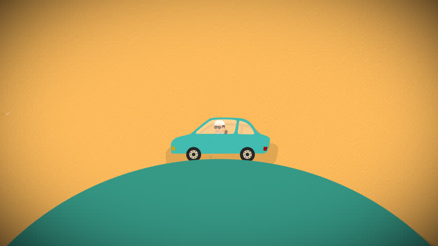
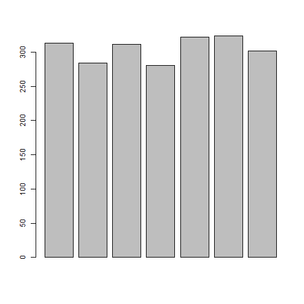

## Few meters readings of a car at each stop are observed.
 


```r
meter.readings <- c(65311,65624,65908,66219,66499,66821,67145,67447)
```
## Based on these readings we can summaraize few questions.

### Question.1 :no. of Kms travelled before each stop
#### Answer :


```r
meter.readings <- c(65311,65624,65908,66219,66499,66821,67145,67447)
d <- meter.readings
km.diff <- diff(d)
print(km.diff)
```

```
## [1] 313 284 311 280 322 324 302
```

### Question.2: Total number of KMs travelled 
#### Answer :


```r
meter.readings <- c(65311,65624,65908,66219,66499,66821,67145,67447)
d <- meter.readings
total <- sum(diff(d))
print(total)
```

```
## [1] 2136
```

### Question.3: Total number of KMs travelled using min() and max()
#### Answer :


```r
d <- meter.readings
mini <- min(d)
maxi <- max(d)
total <- maxi-mini
print(total)
```

```
## [1] 2136
```

###Question.4: Total number of KMs travelled using indices of vector
#### Answer :


```r
d <- meter.readings
mini <- d[1]
maxi <- d[length(d)]
total <- maxi-mini
print(total)
```

```
## [1] 2136
```

### Question.5: Total number of KMs travelled using rev()
#### Answer :


```r
d <- meter.readings
total <- sum(rev(diff(d)))
print(total)
```

```
## [1] 2136
```

### Question.6: Total number of KMs travelled using head() and tail()
#### Answer :


```r
d <- meter.readings
mini <- head(d[1])
maxi <- tail(d[8])
total <- maxi-mini
print(total)
```

```
## [1] 2136
```

### Question.7: Total number of KMs travelled using head() and rev()
#### Answer:


```r
mini <- head(d[1])
maxi <- tail(rev(d[8]))
total <- maxi-mini
print(total)
```

```
## [1] 2136
```

## Grapical representation of car travelled before each stop


```r
barplot(km.diff)
```



